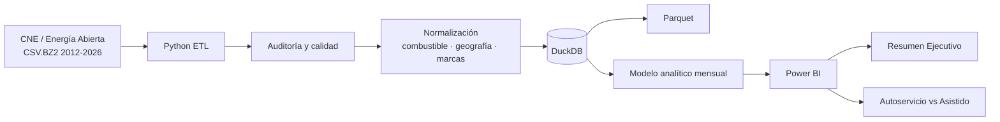

# Arquitectura

## Flujo general

## Capas

### 1. Fuente

Archivos históricos oficiales de la CNE.

### 2. Staging

Carga inicial para auditoría sin perder el contenido original.

### 3. Master

Tabla consolidada de eventos con estructura común para todos los años.

### 4. Normalización

Capas de homologación de:

- combustibles
- regiones y comunas
- marcas y distribuidores
- modalidad de atención

### 5. Analítica

Construcción de snapshots o resúmenes mensuales comparables por estación y combustible.

### 6. Presentación

Power BI consume tablas dimensionales y hechos orientados a preguntas concretas de decisión.

## Tecnologías

`Python → DuckDB → SQL → Parquet → Power BI`

El diseño prioriza una arquitectura local, simple y reproducible antes que una infraestructura cloud innecesaria para el volumen actual.
